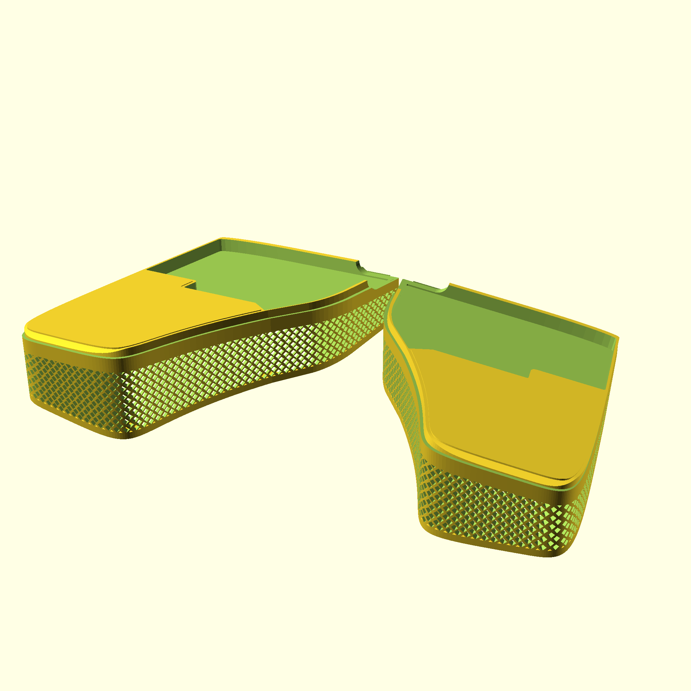

# Ergonomic Case for Lily58 Keyboard

a 3D printable case for the Lily58 keyboard

# Printable Files

You can find the files in [models directory](./models).

Lily58 comes with a default MX spacing, this directory also contains printable case files for the slightly tighter choc
spacing variant from typeractive.xyz.

# Preview

## MX Spacing

[3D preview](./doc/3d/mx_assembly.stl)

## Choc Spacing

[3D preview](./doc/3d/choc_assembly.stl)

## Printed Case
