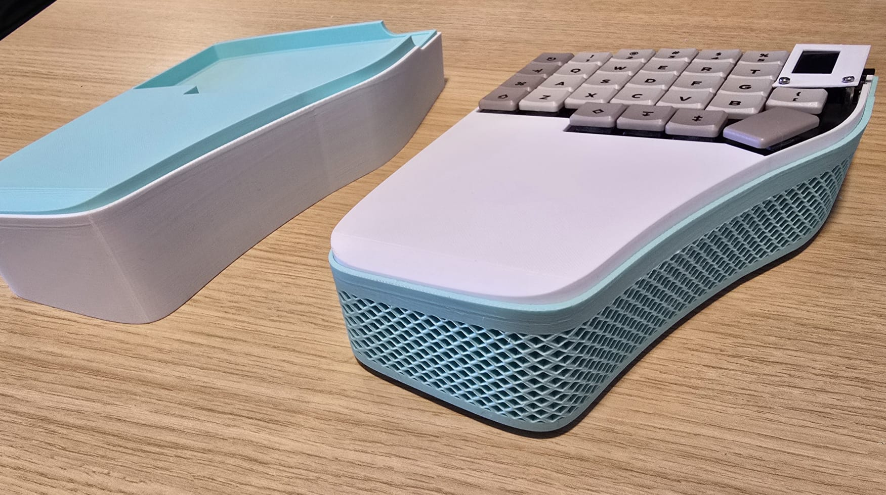
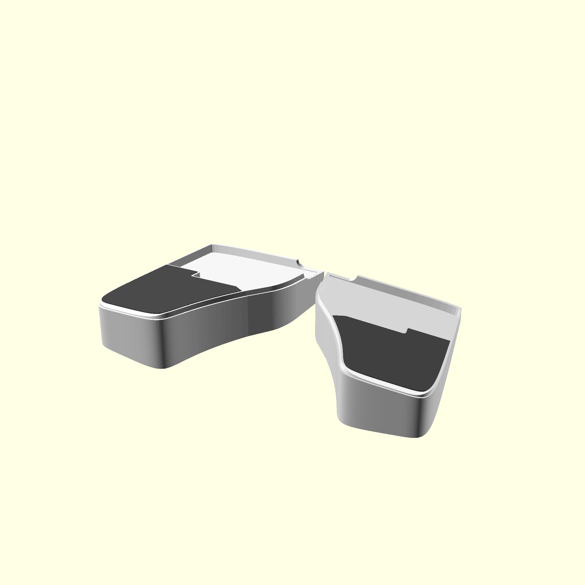

# Ergonomic Case for Lily58 Keyboard

a 3D printable case for the Lily58 keyboard

# Printable Files

You can find the files in [models directory](./models).

Lily58 comes with a default MX spacing, this directory also contains printable case files for the slightly tighter choc
spacing variant from typeractive.xyz.

# Case Parts
Each side of the case includes two printable parts: 
- Keyboard housing which keeps the keyboard in place and adds wrist support
- A stand that holds the keyboard and housing at the defined ergonomic angles.

A third - optional printable part is the screen cover.

# Preview

## MX Spacing

[3D preview](./doc/3d/mx_assembly.stl)

## Choc Spacing

[3D preview](./doc/3d/choc_assembly.stl)

# Customization

You can adjust the angles and heights of the case by modifying `rotation` and `translation` variables
in [src/config.scad](src/config.scad)