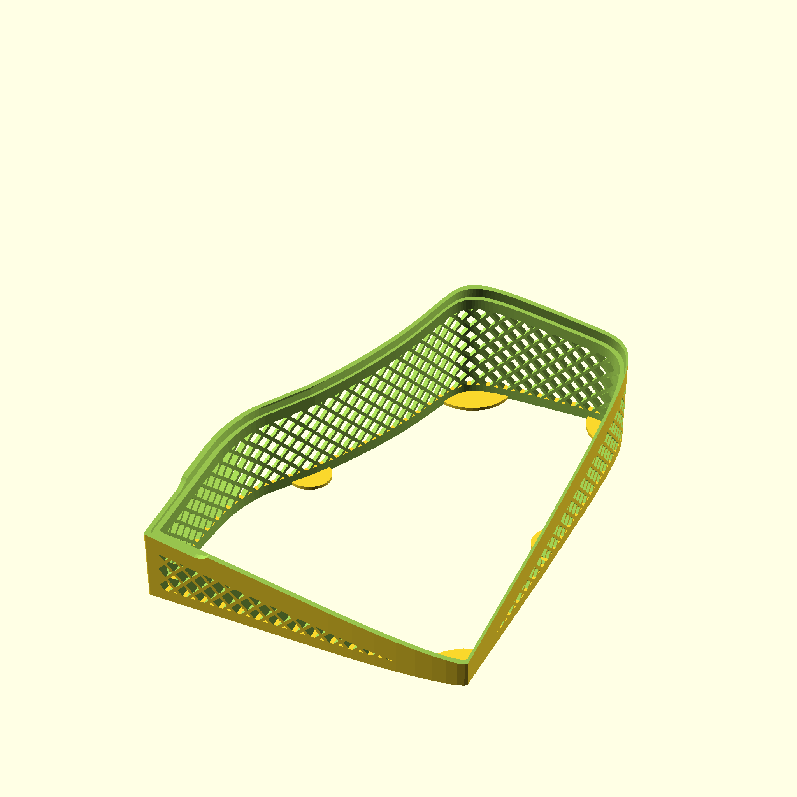

# Ergonomic Case for Lily58 Keyboard

a 3D printable case for the Lily58 keyboard

# Printable Files

You can find the printable files on the [release page](https://github.com/RoniGurvich/Ergo58/releases/tag/latest).

Note that Lily58 comes with a default MX spacing, release files also contain printable files for the slightly smaller
choc
spacing variant from typeractive.xyz.

# Case Parts

Each side of the case includes two printable parts:

- Keyboard housing which keeps the keyboard in place and adds wrist support
- A stand that holds the keyboard and housing at the defined ergonomic angles.

A third - optional printable part is the screen cover.

# Preview

## MX Spacing

[3D preview](./doc/3d/mx_assembly.stl)

## Choc Spacing

[3D preview](./doc/3d/choc_assembly.stl)

# Customization

You can adjust the angles and heights of the case by modifying `rotation` and `translation` variables
in [src/config.scad](src/config.scad).

You can fork this repo, update the configuration and download the resulting files.